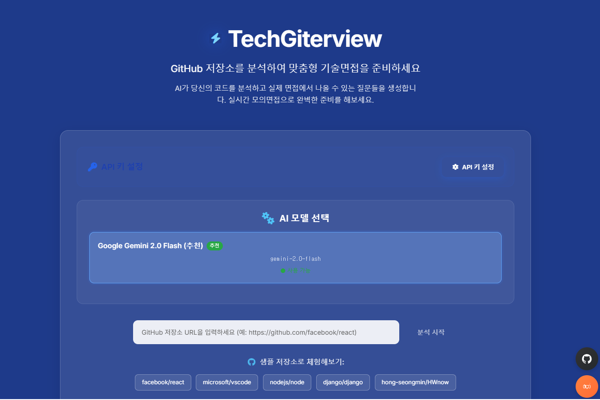
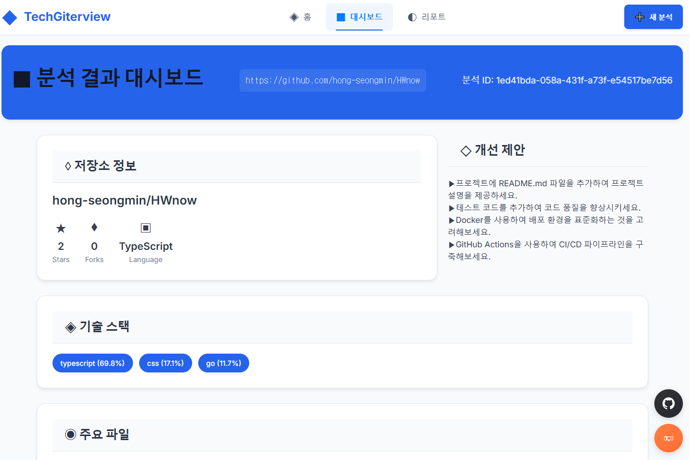
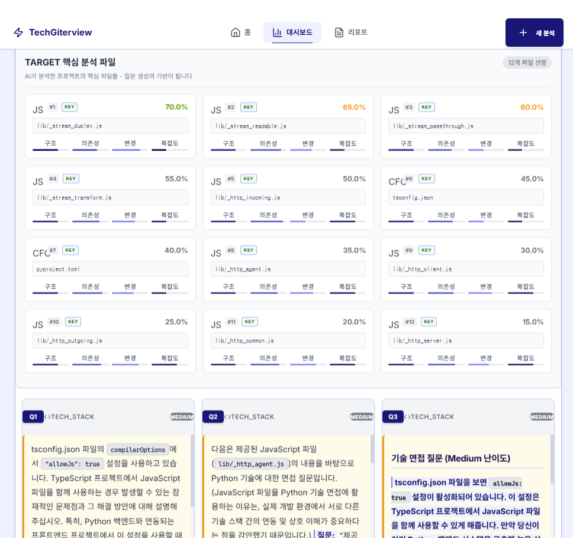
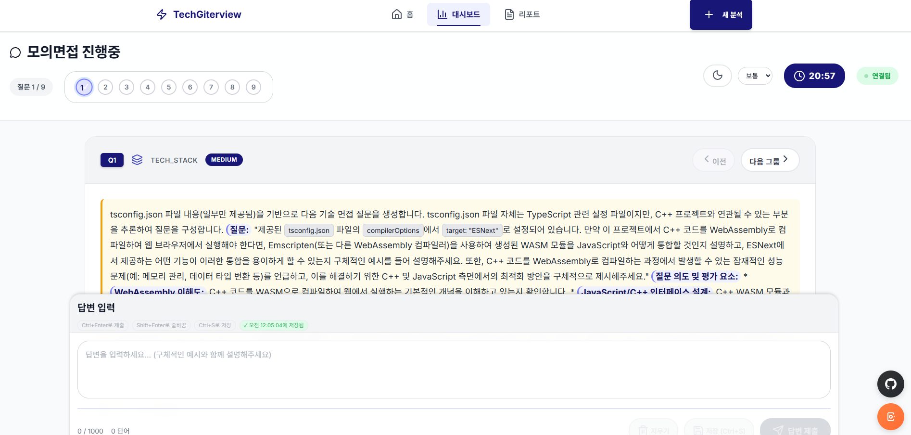

# TechGiterview 🚀

> GitHub 저장소를 분석하여 맞춤형 기술면접 질문을 생성하는 AI 플랫폼

[](LICENSE)
[](https://github.com/hong-seongmin/techGiterview/stargazers)
[](https://tgv.oursophy.com/)

## 📸 Demo Screenshots

### 🏠 홈페이지 & API 키 설정


*GitHub 저장소 URL 입력, AI 모델 선택, API 키 설정 버튼을 포함한 메인 화면*

### 📊 저장소 분석 대시보드
<div align="center">

<br><br>

</div>

*SmartFileImportanceAnalyzer 기반 4차원 파일 분석, 기술 스택 분포, 복잡도 점수 시각화*

### 💬 AI 질문 생성 & 모의면접


*저장소 분석 결과를 바탕으로 생성된 맞춤형 기술면접 질문과 실시간 모의면접*

---

## 🌐 Live Demo

**[🚀 https://tgv.oursophy.com/](https://tgv.oursophy.com/)**

실제 서비스를 바로 체험해보세요! 별도 설치 없이 GitHub 저장소만 있으면 즉시 이용 가능합니다.

## ✨ 주요 기능

### 🔑 유연한 API 키 관리
- **개발환경**: `.env.dev` 파일 기반 설정
- **배포환경**: 웹 UI를 통한 localStorage 기반 보안 설정  
- **개인정보 보호**: API 키는 브라우저에서만 저장, 서버 미전송

### 🧠 스마트 분석 시스템
- **SmartFileImportanceAnalyzer**: 4차원 파일 중요도 분석 (복잡도, 의존성, 크기, 패턴)
- **기술 스택 자동 탐지**: 프로젝트별 맞춤 기술 스택 식별
- **복잡도 점수**: 0-10점 스케일 기반 코드 복잡도 평가

### 🤖 AI 기반 질문 생성
- **Google Gemini 2.0 Flash**: 최신 AI 모델로 고품질 질문 생성
- **맞춤형 질문**: 저장소 분석 결과 기반 특화 질문
- **3가지 유형**: 기술스택, 아키텍처, 코드분석 질문 균형 배분

### 💬 실시간 모의면접
- **WebSocket 기반**: 실시간 대화형 면접 시뮬레이션
- **즉시 피드백**: AI 기반 답변 분석 및 개선 제안
- **진행률 추적**: 질문별 답변 완료도 시각화

### 🎨 모던 UI/UX
- **React 18 + TypeScript**: 최신 웹 기술 스택
- **반응형 디자인**: 데스크톱/모바일 최적화
- **접근성 지원**: WCAG 기준 준수, 다크모드 지원

## 🚀 빠른 시작

### 방법 1: Docker Compose (권장)

```bash
# 1. 프로젝트 클론
git clone https://github.com/hong-seongmin/techGiterview.git
cd techGiterview

# 2. Docker Compose 실행
docker-compose up -d

# 3. 접속
# Frontend: http://localhost:9105
# Backend: http://localhost:9104
# API 문서: http://localhost:9104/docs
```

> 💡 **API 키 설정**: 웹 사이트 접속 후 '**API 키 설정**' 버튼을 클릭하여 GitHub 토큰과 Google API 키를 입력하세요. 키는 브라우저에만 저장되어 안전합니다.

### 방법 2: 개발 환경 설정

```bash
# 1. 프로젝트 클론
git clone https://github.com/hong-seongmin/techGiterview.git
cd techGiterview

# 2. 환경 변수 설정 (개발용)
cp src/backend/.env.example src/backend/.env.dev

# .env.dev 파일에 API 키 설정
GITHUB_TOKEN=ghp_your_github_token
GOOGLE_API_KEY=AIza_your_google_api_key

# 3. Docker Compose 실행
docker-compose up -d
```

### API 키 발급 가이드

#### GitHub Personal Access Token
1. [GitHub Settings > Developer settings > Personal access tokens](https://github.com/settings/tokens) 접속
2. **Generate new token (classic)** 클릭
3. **repo** 권한 체크 (저장소 읽기용)
4. 생성된 `ghp_` 토큰 복사

#### Google API Key (Gemini)  
1. [Google AI Studio](https://aistudio.google.com/app/apikey) 접속
2. **Create API Key** 클릭
3. 생성된 `AIza` 키 복사

## 🛠 기술 스택

### Backend
- **FastAPI** - 고성능 Python 웹 프레임워크
- **Google Gemini 2.0 Flash** - 최신 AI 모델 (질문 생성 & 피드백)
- **LangGraph** - AI 에이전트 워크플로우 관리
- **SmartFileImportanceAnalyzer** - 4차원 파일 중요도 분석 알고리즘
- **PostgreSQL** - 메인 데이터베이스 (분석 결과 저장)
- **Redis** - 캐싱 및 세션 관리
- **ChromaDB** - 벡터 임베딩 저장소
- **aiohttp** - 비동기 HTTP 클라이언트 (GitHub API)

### Frontend  
- **React 18** + **TypeScript** - 모던 웹 프레임워크
- **Vite** - 차세대 빌드 도구 (HMR 지원)
- **CSS Variables** - 동적 테마 시스템 (다크모드 지원)
- **LocalStorage API** - 보안 API 키 관리
- **WebSocket** - 실시간 모의면접 통신
- **Responsive Design** - 모바일 최적화

### DevOps & Infrastructure
- **Docker** + **Docker Compose** - 컨테이너 기반 배포
- **PostgreSQL 15** - 관계형 데이터베이스
- **Redis 7** - 인메모리 캐시
- **Nginx** - 리버스 프록시 (프로덕션)

## 🎯 사용 가이드

### 1️⃣ 저장소 분석
1. [라이브 데모](https://tgv.oursophy.com/) 접속
2. **API 키 설정** 버튼 클릭 → GitHub 토큰, Google API 키 입력
3. GitHub 저장소 URL 입력 (예: `https://github.com/facebook/react`)
4. **분석 시작** 버튼 클릭

### 2️⃣ 분석 결과 확인
- 📊 **기술 스택 분포**: 프로젝트에서 사용된 언어/기술 비율
- 📁 **파일 중요도**: SmartFileImportanceAnalyzer 기반 4차원 분석
- 🎯 **복잡도 점수**: 0-10점 스케일 코드 복잡도 평가

### 3️⃣ AI 질문 생성 & 모의면접
- ❓ **맞춤형 질문**: 분석 결과 기반 기술면접 질문 자동 생성
- 💬 **실시간 면접**: 질문에 답변하고 즉시 AI 피드백 받기
- 📈 **진행률 추적**: 질문별 답변 완료도 시각화

## 🧪 개발 & 테스트

```bash
# 백엔드 테스트
cd src/backend
uv run pytest tests/ -v

# 프론트엔드 테스트
cd src/frontend  
npm test

# Docker 환경 테스트
docker-compose exec backend pytest tests/
```

## 🤝 기여하기

1. 프로젝트 Fork
2. 기능 브랜치 생성: `git checkout -b feature/amazing-feature`
3. 변경사항 커밋: `git commit -m 'Add amazing feature'`
4. 브랜치 Push: `git push origin feature/amazing-feature`
5. Pull Request 생성

## ☕ 후원

이 프로젝트가 도움이 되셨다면 커피 한 잔으로 응원해주세요!

[](https://buymeacoffee.com/oursophy)

## 📄 라이선스

MIT 라이선스 하에 배포됩니다. 자세한 내용은 [LICENSE](LICENSE) 파일을 참조하세요.

## 👨‍💻 개발자

**Hong Seongmin** - [GitHub](https://github.com/hong-seongmin)

---

⭐ 이 프로젝트가 유용하다면 Star를 눌러주세요!